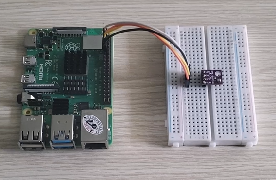
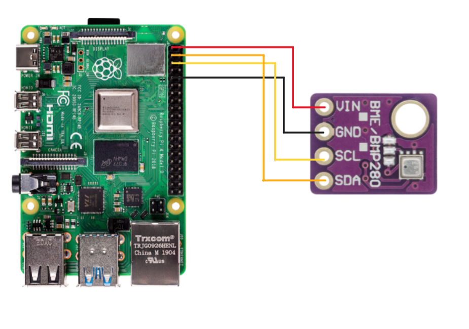

# Raspberry Pi 4B | BMP280 I2C Kernel Driver 🌡️📉

**Author**: Kael Shelby (VTN)

## 📖 1. Introduction
This project implements a **Linux Kernel Driver** for the **BMP280** sensor with **I2C** communication on Raspberry Pi 4B.  
The driver enables reading **temperature, pressure**, and calculating **altitude above sea level**.  

<div align="center">
  
</div>

**Objectives**:  
- Develop `bmp280_driver.c` for kernel space.  
- Test with `test.c` in user space.  
- Manual device integration without device tree.  

---

## 🛠️ 2. Hardware Requirements
To build this project, the following components are required:
- **Raspberry Pi 4B**.  
- **BMP280 sensor** (I2C interface, default address `0x76`).  
- **I2C connection wires** (SDA, SCL, VCC, GND).  

---

## 🔌 3. Circuit Connections

<div align="center">
  
</div>

| Raspberry Pi 4B (Pinout) | BMP280 (I2C) |
|---------------------------|--------------|
| Pin 1 (3.3V)             | VCC          |
| Pin 6 (GND)              | GND          |
| Pin 3 (GPIO2 - SDA1)     | SDA          |
| Pin 5 (GPIO3 - SCL1)     | SCL          |

---

## 🖥️ 4. Software Requirements
- **Operating System**: Raspberry Pi OS (Linux).  
- **Build Tools**: `make`, `gcc`.  
- **Source Files**:  
  - `bmp280_driver.c` – Linux kernel driver.  
  - `Makefile` – Compile driver to `.ko` module.  
  - `test.c` – User space test application.  

---

## 🔧 5. Usage Instructions

### 5.1 Environment Setup
1. **Enable I2C** on Raspberry Pi:
   ```bash
   sudo raspi-config
   ```
    → Interface Options → I2C → Enable.
Reboot the Pi after enabling:
   ```bash
   sudo reboot
   ```
   
2. Connect to Raspberry Pi:
- Direct access: Open Terminal on Raspberry Pi.
- Remote access: Use SSH (ssh pi@raspberrypi.local) or VNC Viewer.

3. Clone or copy source code to any directory and open terminal in that location.

### 5.2. Driver Compilation
   ```bash
   make
   ```
Generates bmp280_driver.ko kernel module.

### 5.3. Load Driver into Kernel
   ```bash
   sudo insmod bmp280_driver.ko
   ```

Monitor kernel logs in another terminal:
   ```bash
   dmesg -w
   ```

Expected output:
   ```bash
   Initializing BMP280 Driver
   ```

### 5.4. Manual I2C Device Binding
Check I2C bus for device detection:
   ```bash
   i2cdetect -y 1
   ```
Device should be detected at address 0x76. Add new device to i2c-1 bus:
   ```bash
   cd /sys/bus/i2c/devices/i2c-1
   echo bmp280 0x76 > new_device
   ```

Kernel log:
   ```bash
   BMP280 Driver Installed
   ```

### 5.5. Test Driver with User Space Application
Return to project directory and compile test program:
   ```bash
   gcc test.c -o test -lm
   ```
Run test application:
   ```bash
   ./test
   ```
👉 Expected Output:
- Display Temperature, Pressure, Altitude on terminal.

Kernel log:
   ```bash
   BMP280 driver opened (khi chạy file test)
   BMP280 driver closed (khi đóng file test)
   ```
### 5.6. Device and Driver Unloading
Remove device:
   ```bash
   echo 0x76 > /sys/bus/i2c/devices/i2c-1/delete_device
   ```
Kernel log:
   ```bash
   BMP280 driver removed
   ```
Unload driver:
   ```bash
   sudo rmmod bmp280_driver.ko
   ```
Clean up directory:
   ```bash
   make clean
   ```

## 📊 6. Results
- Driver successfully reads data from BMP280 sensor via I2C.
- Displays sensor values: temperature, pressure, and calculated altitude.
- Manual device management via sysfs interface.
- Kernel logs confirm proper driver operation and lifecycle.
## 📝 7. Notes
- Default I2C address of BMP280: 0x76 (SDO pin low) or 0x77 (SDO pin high).
- I2C must be enabled on Raspberry Pi before use (raspi-config).
- For multiple sensors, modify I2C address or use different bus when creating devices.

## 🎯 8. Conclusion
- The project successfully implements a Linux Kernel Driver for BMP280 on Raspberry Pi 4B, supporting sensor data acquisition and direct device management in kernel space. The driver demonstrates proper I2C communication, data processing, and sysfs device management.


